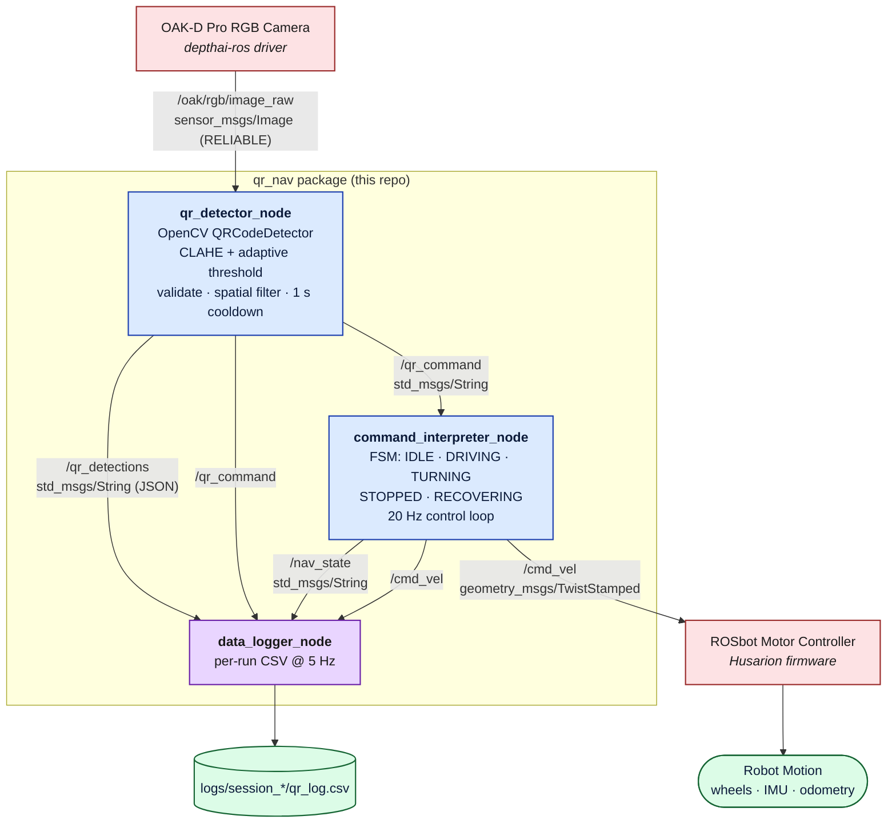

# System Overview & ROS 2 Architecture — `qr_nav`

Reference document for the QR Code Command Navigation stack on the **Husarion ROSbot 3 PRO** (ROS 2 Jazzy, Ubuntu 24.04). Companion to [`../../README.md`](../../README.md) (project overview), [`DEPLOY.md`](DEPLOY.md) (operator runbook), and [`LESSONS_LEARNED.md`](LESSONS_LEARNED.md) (post-mortem).

This file is the **single source of truth** for *what each node does, what topics carry which messages, and why the system is split this way*.

---

## 1. System Overview — The Perception-to-Action Pipeline

The robot has no map, no SLAM stack, and no pre-recorded route. Every motion decision is driven by a **visual instruction** picked up off a printed QR card placed in the environment. The full pipeline runs on the ROSbot's onboard compute (Raspberry Pi 5) and converts pixels into wheel torque in five conceptual stages:

| # | Stage | What it produces | Latency budget |
|---|------------------|---------------------------------------|------------------|
| 1 | **Sense**        | Raw RGB frames from the OAK-D Pro     | ~100 ms (10 Hz observed) |
| 2 | **Perceive**     | Decoded QR string + bbox area         | ≤ 67 ms (15 Hz target) |
| 3 | **Decide**       | FSM state transition + chosen command | < 50 ms |
| 4 | **Act**          | `TwistStamped` velocity command       | 20 Hz control loop |
| 5 | **Move**         | Motor controller drives the wheels    | Husarion firmware |

In plain English:

1. The **OAK-D Pro** publishes RGB frames on `/oak/rgb/image_raw`.
2. The **QR Detector node** decodes any visible QR codes, validates them against the seven known commands, picks the closest one (largest bounding box), debounces it, and publishes a single string on `/qr_command`.
3. The **Command Interpreter node** runs a Finite State Machine. It maps the decoded command into a velocity profile based on the current state (e.g. `STOP` always halts; `GO` only resumes from `STOPPED` or `IDLE`).
4. At 20 Hz, the interpreter emits a `geometry_msgs/TwistStamped` on `/cmd_vel`.
5. The **ROSbot motor controller** (Husarion firmware, outside our package) subscribes to `/cmd_vel` and drives the wheels.

A separate **Data Logger node** sits in parallel — it does not affect motion — and snapshots every relevant topic into a per-run CSV for offline evaluation.

---

## 2. Architecture Diagram

The diagram below shows every ROS 2 node in the running system, with topic names labeled on each edge. Boxes outside the dashed boundary (camera driver, motor controller) are **provided by Husarion's stack**, not by this package.



**Reading the diagram**

- **Solid pipeline (left → right):** `Camera → Detector → Interpreter → Motor Controller → Robot`. This is the closed-loop control path; if any link breaks, the robot stops moving.
- **Logger fan-in (top → bottom):** the logger subscribes to **every observable topic** but publishes nothing. It is intentionally a *passive observer* so that disabling it cannot affect motion.
- **Hardware boundary:** only the camera driver and motor controller are red. Everything blue/purple ships in this package and is launched by [`launch/qr_nav.launch.py`](../launch/qr_nav.launch.py).

---

## 3. Node Responsibilities

### 3.1 `qr_detector_node` — Perception

Source: [`qr_nav/qr_detector_node.py`](../qr_nav/qr_detector_node.py)

| Responsibility | Detail |
|----------------|--------|
| Subscribe to camera | `/oak/rgb/image_raw` with **RELIABLE / VOLATILE** QoS (must match Husarion's publisher). |
| Decode QR codes | OpenCV `cv2.QRCodeDetector.detectAndDecodeMulti()` after CLAHE contrast enhancement. Falls back to adaptive thresholding for degraded codes. |
| Validate | Decoded string must be in the closed set `{TURN_LEFT, TURN_RIGHT, STOP, GO, SPEED_UP, SPEED_DOWN, U_TURN}`. |
| Spatial filter | If multiple QRs are visible, choose the one with the **largest bounding box area** (closest to the camera). |
| Debounce | 1.0 s per-command cooldown — same command published at most once per second. |
| Rate-limit | Processes frames at most at `detection_rate_hz` (15 Hz). |
| Emit raw observations | Always publishes the unfiltered detection array on `/qr_detections` for the logger, even when no command is dispatched. |

### 3.2 `command_interpreter_node` — Decision

Source: [`qr_nav/command_interpreter_node.py`](../qr_nav/command_interpreter_node.py)

| Responsibility | Detail |
|----------------|--------|
| Run the FSM | States: `IDLE` (boot), `DRIVING`, `TURNING`, `STOPPED`, `RECOVERING`. |
| Map command → behavior | E.g. `TURN_LEFT` → `_start_turn(+turn_speed, turn_90_duration)`; `STOP` → `_transition_to(STOPPED)` + zero velocity. |
| Enforce safety invariants | `IDLE` blocks all motion until the first valid command. `STOPPED` only accepts `GO`. `TURNING` ignores all incoming commands (no preemption mid-rotation). |
| Recovery | If no `/qr_command` is received for `recovery_timeout` seconds while `DRIVING`, drop into `RECOVERING` (slow creep at `min_speed`) instead of running blind at cruise speed. |
| Publish velocity | `geometry_msgs/TwistStamped` on `/cmd_vel` at 20 Hz (`control_rate_hz`), stamped with `base_link`. |
| Publish state | `std_msgs/String` on `/nav_state` on every transition — gives the logger and any future UI a clean audit trail. |
| Shutdown safety | On `Ctrl-C`, publishes a final zero-twist before exiting so the robot doesn't coast on the last command. |

### 3.3 `data_logger_node` — Observation

Source: [`qr_nav/data_logger_node.py`](../qr_nav/data_logger_node.py)

| Responsibility | Detail |
|----------------|--------|
| Subscribe to everything | `/qr_command`, `/qr_detections`, `/nav_state`, `/cmd_vel`. |
| Write CSV at 5 Hz | One row per tick: timestamp, elapsed seconds, last command, full detection JSON, FSM state, linear & angular velocity, detection-event flag. |
| Resolve log path | Prefers `$QR_NAV_RUN_DIR` (set by [`tools/qr_logging_env.sh`](../../tools/qr_logging_env.sh)), then the `log_directory` parameter, finally falling back to `<repo>/logs/qr_log_<TS>.csv`. |
| Summary on shutdown | Prints command counts and per-state time distribution to the console. |
| Side-effect free | Publishes nothing — disabling the logger cannot affect the robot. |

---

## 4. ROS 2 Topics & Message Types

| Topic | Direction | Type | Producer | Consumers |
|-------|-----------|------|----------|-----------|
| `/oak/rgb/image_raw` | input | `sensor_msgs/msg/Image` | OAK-D driver (depthai-ros) | `qr_detector_node` |
| `/qr_command` | internal | `std_msgs/msg/String` | `qr_detector_node` | `command_interpreter_node`, `data_logger_node` |
| `/qr_detections` | internal | `std_msgs/msg/String` (JSON payload) | `qr_detector_node` | `data_logger_node` |
| `/nav_state` | internal | `std_msgs/msg/String` | `command_interpreter_node` | `data_logger_node` |
| `/cmd_vel` | output | `geometry_msgs/msg/TwistStamped` | `command_interpreter_node` | ROSbot motor controller, `data_logger_node` |

**Why these specific message types**

- `sensor_msgs/Image` — the ROS 2 standard for raw camera frames. The detector converts to OpenCV BGR via `cv_bridge`.
- `std_msgs/String` for commands — the command vocabulary is a small, closed enum, but using `String` keeps the contract human-readable in `ros2 topic echo` during debugging. The validation step in the detector enforces type safety logically.
- `std_msgs/String` carrying **JSON** for `/qr_detections` — lets us log structured detection metadata (timestamp, content, bbox area) without defining a custom `.msg` file. Custom messages would require a CMake-driven interface package and re-build cycle that isn't justified here.
- `geometry_msgs/TwistStamped` — Husarion's ROSbot 3 PRO controller on Jazzy expects `TwistStamped`, **not plain `Twist`**. Publishing `Twist` results in a silent type mismatch and the wheels never move. (See `LESSONS_LEARNED.md` for the bring-up bug that exposed this.)

---

## 5. Data Flow Walkthrough — One QR Card, End to End

To make the architecture concrete, here is exactly what happens when an operator holds a `TURN_LEFT` card in front of the camera while the robot is `DRIVING`:

1. **t = 0 ms** — OAK-D publishes a frame on `/oak/rgb/image_raw`.
2. **t ≈ 5 ms** — `qr_detector_node`'s `image_callback` fires. It rate-limits to 15 Hz, runs CLAHE, and calls `detectAndDecodeMulti`.
3. **t ≈ 30 ms** — Decoder returns `"TURN_LEFT"` with bbox area ≈ 8 000 px². Area > `min_bbox_area` (500), command is in `VALID_COMMANDS`, last-published timestamp > 1 s ago → cooldown passes.
4. **t ≈ 31 ms** — Detector publishes:
   - `/qr_detections` ← JSON `[{"timestamp":..., "content":"TURN_LEFT", "bbox_area":8000.0}]`
   - `/qr_command`    ← `"TURN_LEFT"`
5. **t ≈ 32 ms** — `command_interpreter_node`'s `command_callback` fires. State is `DRIVING`, so it falls through to `_execute_command`. `TURN_LEFT` triggers `_start_turn(+0.4 rad/s, 4.0 s)` and transitions FSM → `TURNING`.
6. **t = 32 ms onwards** — At 20 Hz, the `control_loop` publishes `TwistStamped(linear.x=0, angular.z=0.4)` until 4 s elapse, then transitions back to `DRIVING` and resumes `linear.x=cruise_speed`.
7. **In parallel** — `data_logger_node` records every callback into its CSV row at 5 Hz, plus the JSON detection at the moment it arrived.
8. **Simultaneously** — Husarion's motor controller consumes `/cmd_vel` and turns the wheels.

If at any point `/qr_command` stops arriving for 3 s while `DRIVING` (e.g. operator walks away with the card), the FSM drops into `RECOVERING` and the wheels slow to `min_speed` instead of running blind.

---

## 6. Why Modular ROS 2 Architecture

The 7-command navigation problem could in principle be solved by a single 300-line script that grabs frames, decodes QRs, and writes to a serial port. We deliberately did not do that. Splitting the system into three nodes communicating over typed topics buys us three concrete benefits:

### 6.1 Debugging — Each topic is a built-in probe

ROS 2 turns every inter-node boundary into a free observability point. During Stage 1–4 bring-up (see [`DEPLOY.md`](DEPLOY.md)), we never had to add `print()` statements:

```bash
ros2 topic echo /qr_command           # is the detector firing?
ros2 topic hz   /oak/rgb/image_raw    # is the camera publishing?
ros2 topic info /cmd_vel -v           # is the message type correct?
ros2 topic echo /nav_state            # what state is the FSM in?
```

A monolithic implementation would force us to instrument the code itself. With the topic boundary, an external tool (`rqt_graph`, `foxglove_bridge`, `data_logger_node`) can subscribe at any point without touching the production code.

### 6.2 Scalability — Components compose without code changes

- **Swap the perception backend.** Replacing OpenCV with a YOLO-based detector means writing a new node that publishes the same `/qr_command` contract. The FSM doesn't notice.
- **Swap the actuator.** Pointing `/cmd_vel` at Gazebo, a different robot, or a `/cmd_vel_dummy` topic for dry runs is a one-line launch-arg change (see [`launch/qr_nav.launch.py`](../launch/qr_nav.launch.py)). No code rebuild.
- **Add new commands.** Each new QR string is a single entry in `VALID_COMMANDS` plus a branch in `_execute_command`. Detector and interpreter scale independently.
- **Add new sensors.** A future obstacle-avoidance node can subscribe to `/qr_command` *and* a LiDAR topic, and emit its own `/cmd_vel` — multiplexed by a `twist_mux` node — without modifying anything in `qr_nav`.

### 6.3 Fault Isolation — One process crash ≠ one robot crash

ROS 2 nodes are separate OS processes by default. This pays off in three ways:

- **Crash containment.** If the detector hits an OpenCV assertion (we did, on `cv2.contourArea` with `float64` — see `LESSONS_LEARNED.md`), the interpreter keeps running and continues to publish its **last commanded** velocity. We added a `recovery_timeout` so that "last commanded" isn't `cruise_speed` forever — it degrades gracefully to `RECOVERING` after 3 s of silence.
- **Independent restart.** Restarting just the detector with `ros2 run qr_nav qr_detector` doesn't lose FSM state or interrupt logging.
- **Safety invariants are local.** The interpreter is the *only* node that can publish `/cmd_vel`. The detector cannot accidentally drive the robot, and the logger structurally cannot — it has no `/cmd_vel` publisher. Reviewing safety reduces to reviewing one ~290-line file ([`command_interpreter_node.py`](../qr_nav/command_interpreter_node.py)).

### 6.4 Bonus — Configurability without recompiling

All tunables (`cruise_speed`, `turn_90_duration`, `min_bbox_area`, QoS reliability, log paths) live in [`config/qr_params.yaml`](../config/qr_params.yaml) and are wired into each node via `declare_parameter`. Re-tuning for a demo run is a YAML edit + relaunch — the architecture forced us to surface every magic number as a parameter.

---

## 7. Reference Index

- Launch: [`src/launch/qr_nav.launch.py`](../launch/qr_nav.launch.py)
- Parameters: [`src/config/qr_params.yaml`](../config/qr_params.yaml)
- Detector: [`src/qr_nav/qr_detector_node.py`](../qr_nav/qr_detector_node.py)
- Interpreter / FSM: [`src/qr_nav/command_interpreter_node.py`](../qr_nav/command_interpreter_node.py)
- Logger: [`src/qr_nav/data_logger_node.py`](../qr_nav/data_logger_node.py)
- Operator runbook: [`DEPLOY.md`](DEPLOY.md)
- Bring-up post-mortem: [`LESSONS_LEARNED.md`](LESSONS_LEARNED.md)
